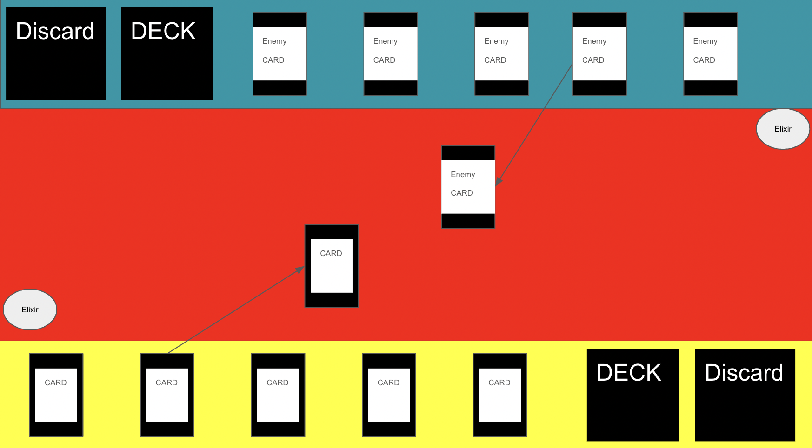
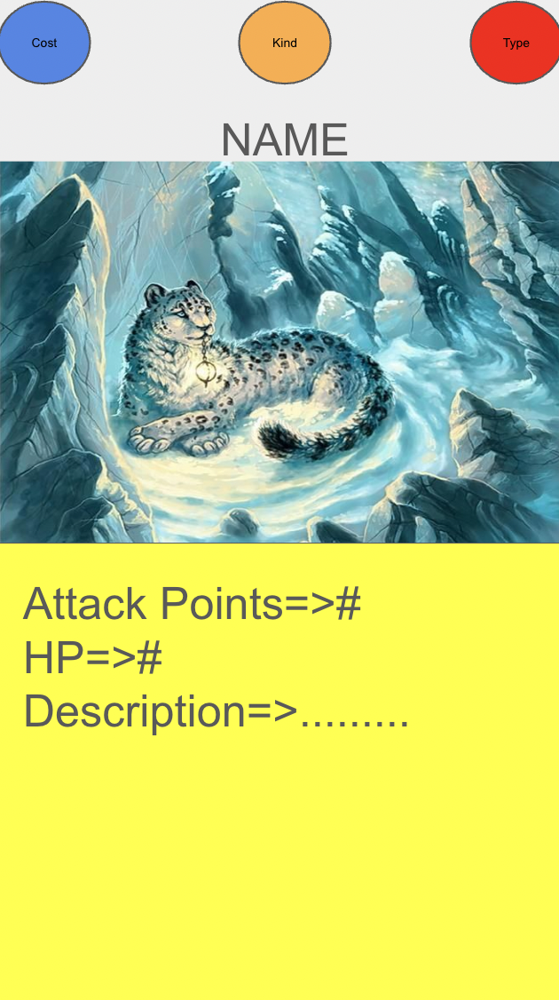

# **Game Name Here**

## _Game Design Document_

---

##### **Copyright notice / author information / boring legal stuff nobody likes**

##
## _Index_

---

1. [Index](#index)
2. [Game Design](#game-design)
    1. [Summary](#summary)
    2. [Gameplay](#gameplay)
    3. [Mindset](#mindset)
3. [Technical](#technical)
    1. [Screens](#screens)
    2. [Controls](#controls)
    3. [Mechanics](#mechanics)
4. [Level Design](#level-design)
    1. [Themes](#themes)
        1. Ambience
        2. Objects
            1. Ambient
            2. Interactive
        3. Challenges
    2. [Game Flow](#game-flow)
5. [Development](#development)
    1. [Abstract Classes](#abstract-classes--components)
    2. [Derived Classes](#derived-classes--component-compositions)
6. [Graphics](#graphics)
    1. [Style Attributes](#style-attributes)
    2. [Graphics Needed](#graphics-needed)
7. [Sounds/Music](#soundsmusic)
    1. [Style Attributes](#style-attributes-1)
    2. [Sounds Needed](#sounds-needed)
    3. [Music Needed](#music-needed)
8. [Schedule](#schedule)

## _Game Design_

---

### **Summary**

This is an exciting Player vs Environment (PVE) Card Building (CBG), Trading Card Game (TCG) set in a dystopian fantasy world which has been conquered by a powerful evil wizard that has put magical enforcers in place to defend and empower his empire. As a powerful wizard with a great destiny, it is the player's responsibility to build their deck of magical creatures and face off against the dark wizard's minions and their own creatures in order to, eventually, face him and, for the sake of his world, win! 

### **Gameplay**

The game will, in escence, be a roadmap of levels leading towards the player's final confrontation with the game's final boss, the dark wizard. In each level, the player will face off against one of the wizard's lackeys who, alike his master and the player, will have an affinity with magic. Each magic wielder can, in a sense, command a series of magical elemental creatures which can belong to one of three categories: fire, water, or nature. 

Before each match, the player will have the ability to create their own deck of twenty five cards from those in his inventory. The player will initially have the exact amount of cards needed to build a deck. As the player progresses, they will be able to add more cards to their arsenal and will, therefore, be able to customize their deck.

There will be two card categories: troops and complimentary cards (spells and artifacts, among others). At the begining of every match, five random cards will automatically be set in the player's hand. Each turn, both the player and his rival will be able to do one of three things: 

    1. Place a troop card in the battle field (each player can have only one card in the battlefield at any point in time).
    2. Use a complimentary card (for either offensive or defensive purposes).
    3. Attack the opponent's active troop with their own. 

It is important to note that there will be certain mechanics related to the elements associated with each troop in the battlefield. There is a rock-paper-scissors power dynamic between the three elements in the game which can be explained as follows:

    Water is stronger than Fire
    Fire is stronger than Nature
    Nature is stronger than Water

If a card is stronger than the card it's up against, the damage inflicted by one of its attacks will automatically be doubled. The opposite will happen if the card is weaker than its opponent. Complimentary cards can be used to either amplify damage exertion or reduce damage received. Players will have to bear both the elemental power dynamic and the tools at their disposal (complimentary cards) in mind to form effective strategies.

Every time a card in the player's hand is used, another from their deck fills the vacancy left by said card.
    
In order to fuel their magical movements (the use of different cards and attacking with active cards), both players will require certain amounts of a magical energy that has not yet been named, though the preliminary term in use is "Elixir". Elixir is won each turn as a function of the damage inflicted upon enemy troops. This is to say, the more damage a player does to their opponent, the more Elixir they will gain to fuel subsequent attacks. If a player inflicts no damage during a turn, they will gain no Elixir.

To win, a player must defeat all of his opponent's cards before one of the following scenarios takes place: 

    1. The player runs out of Elixir due to a lack of damage inflicted.
    2. The player runs out of cards in his deck before defeating all of his opponent's cards.

If the player manages to defeat his opponent, the match will come to an end and the wizard will be able to collect a reward from his fallen adversary. The lackey's cards will be set face down on a black screen and the player will have to decide which card to keep. Once they select one, it will be revealed and added to their inventory. 

Only after having beaten a level, the player will unlock the next one and be able to face a new, more powerful rival. This process will continue until the player defeats the dark wizard and beats the game.

The following is a preliminary idea of what an average level would look like: 

    
Granted, a significant amount of detail is missing. Nevertheless, it conveys the main concepts of a level from the player's perspective. It has not yet been decided whether or not the player will be able to see their opponent's elixir and the cards in their hand. 

The image below represents an imaginary card in order to express the overall layout of a card in the game:

The cost represents the amount of elixir required to place the card in the battle field (or use it in case it is a complimentary card). The kind refers to the element of the card, and the type indicates whether it is a troop or a complimentary card.

#### **Game Genre**

The game is considered to be a PVE, TCG, CBG. The following are the reasons that justify this classification:

1. Trading Card Game (TCG):
   - Collectible cards with unique attributes and abilities.
   - Players build personalized decks by selecting cards from their collection.
   - The emphasis on collecting and strategic deck-building is tailored for a solo experience.

2. Card Building:
   - Players have the ability to construct and customize their deck of cards.
   - Deck composition significantly influences strategic gameplay.
   - The card-building aspect is designed for solo players to create their unique strategies.

3. PvE (Player vs. Environment):
   - Levels consist of facing off against challenging AI-controlled opponents, the dark wizard's lackeys.
   - Each level introduces progressively more powerful opponents, creating a solo PvE progression.
   - Winning conditions involve defeating all opponent cards in a turn-based, solo PvE setting.

#### **Statistics Collection**

Throughout the game, it will be important for certain statistics to be collected and stored within the game's database. For instance, information about each level needs to be added. This information could include Player IDs, the date on which it was played, the duration, the winner, amongst other things. This will allow the gama to keep track of games played and determine whether the player has earned the right to continue to the next level. Additionally information about every turn, including the players involved, the start point, the duration, and the turn status will be relevant if, for any reason, the player decides to pause the level and resume at a later point in time. Information about the cards in a player's inventory will be necessary to allow them to modify their decks as they gain more cards. The decks themselves will also need to be registered in the database and tracked for them to be used efficiently in different levels. These are merely some of the various statistics that will be collected in order for the game to function adequately.

#### **Visual Style**

The game will showcase a captivating visual style that will seamlessly blend fantasy and dystopia within a realm governed by a malevolent wizard. Detailed and vibrant illustrations of cards and characters will capture the magical essence of the universe. The user interface, designed to resemble a parchment or enchanted stone, will harmoniously align with the narrative. Magical animations and visual effects will elevate the experience, immersing players in an enchanting and visually striking card game.

### **Mindset**

The objective of the game is the same as that of any other game, to entertain the player. In order to achieve this, it is of the utmost importance to ensure the player enters a certain mindset while playing that motivates them to be resilient, persevere, and beat the game. The point is for the player to feel as identified with the wizard protagonist as possible in terms of power and importance. It is intended for the player to be as invested in the character as possible. They should feel adventurous so as to try bold and exciting strategies with the cards at their disposal. However, it is important for the player to feel increasingly threatened, to a certain extent, as the levels go on in order for them to appreciate that the game's difficulty is progressively becoming more intense. This should ultimately make the experience of playing the game considerably entertaining. 

Certain key parts of the game will have narration so as to increase the degree to which the player is invested in each level. Due to time constraints, these narrative portions will not be in video format. However, text will appear to tell the epic story the player is a part of. 

In order to progressively increase the difficulty level, each opponent's cards will be more powerful or have more health than those of the opponent that came before (all within the player's capabilities). This will make the player feel more nervous and force them to develop better strategies. However, this will also make beating each level more rewarding, as the player will have proven to themselves that they are capable of surpassing complex challenges, and they will be able to add interesting, new, powerful cards to their collection.

## _Technical_

---

### **Screens**

1. Title Screen
    1. Options
2. Level Select
3. Game
    1. Inventory
    2. Assessment / Next Level
4. End Credits

_(example)_

### **Controls**

How will the player interact with the game? Will they be able to choose the controls? What kind of in-game events are they going to be able to trigger, and how? (e.g. pressing buttons, opening doors, etc.)

### **Mechanics**

Are there any interesting mechanics? If so, how are you going to accomplish them? Physics, algorithms, etc.

## _Level Design_

---

_(Note : These sections can safely be skipped if they&#39;re not relevant, or you&#39;d rather go about it another way. For most games, at least one of them should be useful. But I&#39;ll understand if you don&#39;t want to use them. It&#39;ll only hurt my feelings a little bit.)_

### **Themes**

1. Forest
    1. Mood
        1. Dark, calm, foreboding
    2. Objects
        1. _Ambient_
            1. Fireflies
            2. Beams of moonlight
            3. Tall grass
        2. _Interactive_
            1. Wolves
            2. Goblins
            3. Rocks
2. Castle
    1. Mood
        1. Dangerous, tense, active
    2. Objects
        1. _Ambient_
            1. Rodents
            2. Torches
            3. Suits of armor
        2. _Interactive_
            1. Guards
            2. Giant rats
            3. Chests

_(example)_

### **Game Flow**

1. Player starts in forest
2. Pond to the left, must move right
3. To the right is a hill, player jumps to traverse it (&quot;jump&quot; taught)
4. Player encounters castle - door&#39;s shut and locked
5. There&#39;s a window within jump height, and a rock on the ground
6. Player picks up rock and throws at glass (&quot;throw&quot; taught)
7. … etc.

_(example)_

## _Development_

---

### **Abstract Classes / Components**

1. BasePhysics
    1. BasePlayer
    2. BaseEnemy
    3. BaseObject
2. BaseObstacle
3. BaseInteractable

_(example)_

### **Derived Classes / Component Compositions**

1. BasePlayer
    1. PlayerMain
    2. PlayerUnlockable
2. BaseEnemy
    1. EnemyWolf
    2. EnemyGoblin
    3. EnemyGuard (may drop key)
    4. EnemyGiantRat
    5. EnemyPrisoner
3. BaseObject
    1. ObjectRock (pick-up-able, throwable)
    2. ObjectChest (pick-up-able, throwable, spits gold coins with key)
    3. ObjectGoldCoin (cha-ching!)
    4. ObjectKey (pick-up-able, throwable)
4. BaseObstacle
    1. ObstacleWindow (destroyed with rock)
    2. ObstacleWall
    3. ObstacleGate (watches to see if certain buttons are pressed)
5. BaseInteractable
    1. InteractableButton

_(example)_

## _Graphics_

---

### **Style Attributes**

What kinds of colors will you be using? Do you have a limited palette to work with? A post-processed HSV map/image? Consistency is key for immersion.

What kind of graphic style are you going for? Cartoony? Pixel-y? Cute? How, specifically? Solid, thick outlines with flat hues? Non-black outlines with limited tints/shades? Emphasize smooth curvatures over sharp angles? Describe a set of general rules depicting your style here.

Well-designed feedback, both good (e.g. leveling up) and bad (e.g. being hit), are great for teaching the player how to play through trial and error, instead of scripting a lengthy tutorial. What kind of visual feedback are you going to use to let the player know they&#39;re interacting with something? That they \*can\* interact with something?

### **Graphics Needed**

1. Characters
    1. Human-like
        1. Goblin (idle, walking, throwing)
        2. Guard (idle, walking, stabbing)
        3. Prisoner (walking, running)
    2. Other
        1. Wolf (idle, walking, running)
        2. Giant Rat (idle, scurrying)
2. Blocks
    1. Dirt
    2. Dirt/Grass
    3. Stone Block
    4. Stone Bricks
    5. Tiled Floor
    6. Weathered Stone Block
    7. Weathered Stone Bricks
3. Ambient
    1. Tall Grass
    2. Rodent (idle, scurrying)
    3. Torch
    4. Armored Suit
    5. Chains (matching Weathered Stone Bricks)
    6. Blood stains (matching Weathered Stone Bricks)
4. Other
    1. Chest
    2. Door (matching Stone Bricks)
    3. Gate
    4. Button (matching Weathered Stone Bricks)

_(example)_

## _Sounds/Music_

---

### **Style Attributes**

Again, consistency is key. Define that consistency here. What kind of instruments do you want to use in your music? Any particular tempo, key? Influences, genre? Mood?

Stylistically, what kind of sound effects are you looking for? Do you want to exaggerate actions with lengthy, cartoony sounds (e.g. mario&#39;s jump), or use just enough to let the player know something happened (e.g. mega man&#39;s landing)? Going for realism? You can use the music style as a bit of a reference too.

 Remember, auditory feedback should stand out from the music and other sound effects so the player hears it well. Volume, panning, and frequency/pitch are all important aspects to consider in both music _and_ sounds - so plan accordingly!

### **Sounds Needed**

1. Effects
    1. Soft Footsteps (dirt floor)
    2. Sharper Footsteps (stone floor)
    3. Soft Landing (low vertical velocity)
    4. Hard Landing (high vertical velocity)
    5. Glass Breaking
    6. Chest Opening
    7. Door Opening
2. Feedback
    1. Relieved &quot;Ahhhh!&quot; (health)
    2. Shocked &quot;Ooomph!&quot; (attacked)
    3. Happy chime (extra life)
    4. Sad chime (died)

_(example)_

### **Music Needed**

1. Slow-paced, nerve-racking &quot;forest&quot; track
2. Exciting &quot;castle&quot; track
3. Creepy, slow &quot;dungeon&quot; track
4. Happy ending credits track
5. Rick Astley&#39;s hit #1 single &quot;Never Gonna Give You Up&quot;

_(example)_

## _Schedule_

---

_(define the main activities and the expected dates when they should be finished. This is only a reference, and can change as the project is developed)_

1. develop base classes
    1. base entity
        1. base player
        2. base enemy
        3. base block
  2. base app state
        1. game world
        2. menu world
2. develop player and basic block classes
    1. physics / collisions
3. find some smooth controls/physics
4. develop other derived classes
    1. blocks
        1. moving
        2. falling
        3. breaking
        4. cloud
    2. enemies
        1. soldier
        2. rat
        3. etc.
5. design levels
    1. introduce motion/jumping
    2. introduce throwing
    3. mind the pacing, let the player play between lessons
6. design sounds
7. design music

_(example)_
