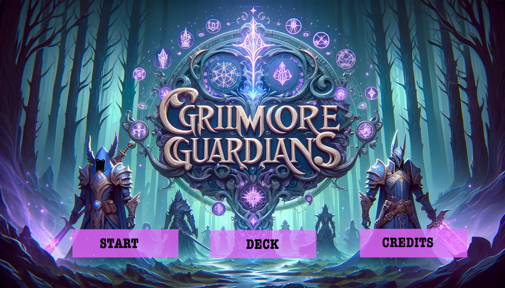
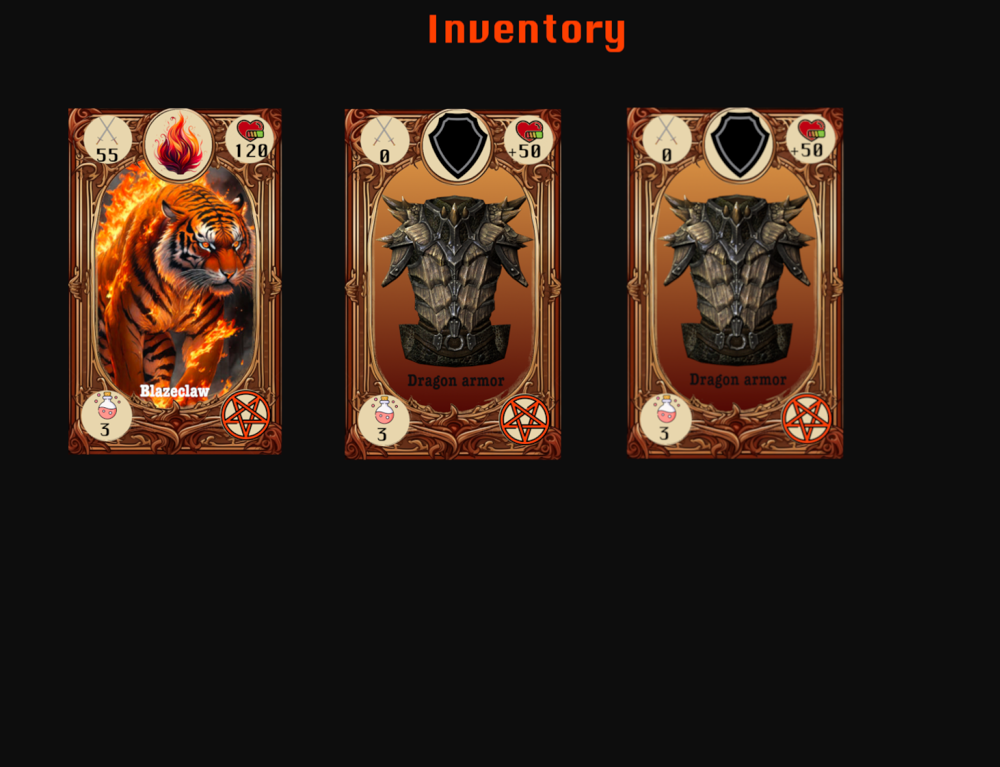
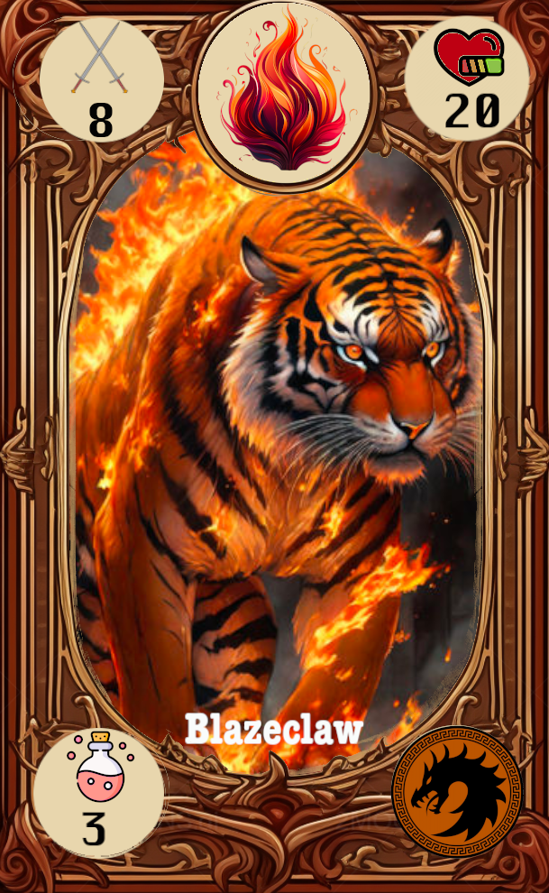
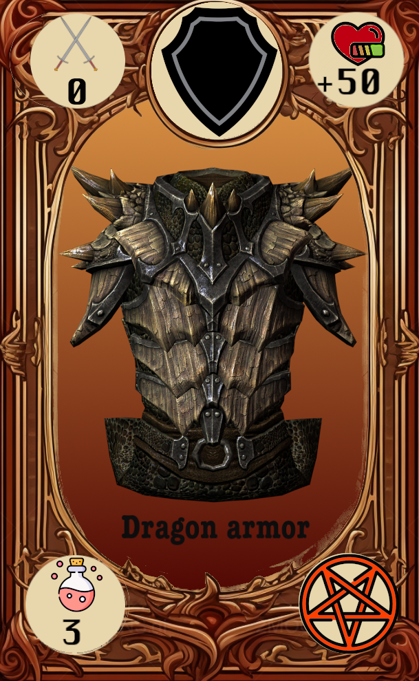

# **Game Name Here**

## _Game Design Document_

---

##### **Copyright notice / author information / boring legal stuff nobody likes**

##
## _Index_

---

1. [Index](#index)
2. [Game Design](#game-design)
    1. [Summary](#summary)
    2. [Gameplay](#gameplay)
    3. [Mindset](#mindset)
3. [Technical](#technical)
    1. [Screens](#screens)
    2. [Controls](#controls)
    3. [Mechanics](#mechanics)
4. [Level Design](#level-design)
    1. [Themes](#themes)
        1. Ambience
        2. Objects
            1. Ambient
            2. Interactive
        3. Challenges
    2. [Game Flow](#game-flow)
5. [Development](#development)
    1. [Abstract Classes](#abstract-classes--components)
    2. [Derived Classes](#derived-classes--component-compositions)
6. [Graphics](#graphics)
    1. [Style Attributes](#style-attributes)
    2. [Graphics Needed](#graphics-needed)
7. [Sounds/Music](#soundsmusic)
    1. [Style Attributes](#style-attributes-1)
    2. [Sounds Needed](#sounds-needed)
    3. [Music Needed](#music-needed)
8. [Schedule](#schedule)

## _Game Design_

---

### **Summary**

This is an exciting Player vs Environment (PVE) Card Building (CBG), Trading Card Game (TCG) set in a dystopian fantasy world which has been conquered by a powerful evil wizard that has put magical enforcers in place to defend and empower his empire. As a powerful wizard with a great destiny, it is the player's responsibility to build their deck of magical creatures and face off against the dark wizard's minions and their own creatures in order to, eventually, face him and, for the sake of his world, win! 

### **Gameplay**

The game will, in escence, be a roadmap of levels leading towards the player's final confrontation with the game's final boss, the dark wizard. In each level, the player will face off against one of the wizard's lackeys who, alike his master and the player, will have an affinity with magic. Each magic wielder can, in a sense, command a series of magical elemental creatures which can belong to one of three categories: fire, water, or nature. 

Before each match, the player will have the ability to create their own deck of twenty five cards from those in his inventory. The player will initially have the exact amount of cards needed to build a deck. As the player progresses, they will be able to add more cards to their arsenal and will, therefore, be able to customize their deck.

There will be two card categories: troops and complimentary cards (spells and artifacts, among others). At the begining of every match, five random cards will automatically be set in the player's hand. Each turn, both the player and his rival will be able to do one of three things: 

    1. Place a troop card in the battle field (each player can have only one card in the battlefield at any point in time).
    2. Use a complimentary card (for either offensive or defensive purposes).
    3. Attack the opponent's active troop with their own. 

It is important to note that there will be certain mechanics related to the elements associated with each troop in the battlefield. There is a rock-paper-scissors power dynamic between the three elements in the game which can be explained as follows:

    Water is stronger than Fire
    Fire is stronger than Nature
    Nature is stronger than Water

If a card is stronger than the card it's up against, the damage inflicted by one of its attacks will automatically be doubled. The opposite will happen if the card is weaker than its opponent. Complimentary cards can be used to either amplify damage exertion or reduce damage received. Players will have to bear both the elemental power dynamic and the tools at their disposal (complimentary cards) in mind to form effective strategies.

Every time a card in the player's hand is used, another from their deck fills the vacancy left by said card.
    
In order to fuel their magical movements (the use of different cards and attacking with active cards), both players will require certain amounts of a magical energy that has not yet been named, though the preliminary term in use is "Elixir". Elixir is won each turn,in a regular basis,but, the elixir can also be won as a function of the health points of the troop card that is in play. This is to say, the more damage a troop has, the more Elixir they will gain to fuel subsequent attacks.Let's clarify this "mechanic" some more, if we (the player), have a card on the field, and that card has 80 base health points, but the enemy inflicts a certain amount of damage, our card now has a certain percentage of life depending on its health points, this, by default, triggering the event of duplicating the elixir won each round the card is in the battlefield.The percentage from which the duplicating elixir will trigger, is still to be determined later on.

In order to let the player know the effect has started, we plan to implement a certain type of UI effect, this could be a message, and alert, or even a glow around the card in the field.

To win, a player must defeat all of his opponent's cards before one of the following scenarios takes place: 

    1. The player runs out of cards in his deck before defeating all of his opponent's cards.

If the player manages to defeat his opponent, the match will come to an end and the wizard will be able to collect a reward from his fallen adversary. The lackey's cards will be set face down on a black screen and the player will have to decide which card to keep. Once they select one, it will be revealed and added to their inventory. 

Only after having beaten a level, the player will unlock the next one and be able to face a new, more powerful rival. This process will continue until the player defeats the dark wizard and beats the game.

The following is a preliminary idea of what an average level would look like: 

    
Granted, a significant amount of detail is missing. Nevertheless, it conveys the main concepts of a level from the player's perspective. It has not yet been decided whether or not the player will be able to see their opponent's elixir and the cards in their hand. 

The image below represents an imaginary card in order to express the overall layout of a card in the game:

The cost represents the amount of elixir required to place the card in the battle field (or use it in case it is a complimentary card). The kind refers to the element of the card, and the type indicates whether it is a troop or a complimentary card.

#### **Game Genre**

The game is considered to be a PVE, TCG, CBG. The following are the reasons that justify this classification:

1. Trading Card Game (TCG):
   - Collectible cards with unique attributes and abilities.
   - Players build personalized decks by selecting cards from their collection.
   - The emphasis on collecting and strategic deck-building is tailored for a solo experience.

2. Card Building:
   - Players have the ability to construct and customize their deck of cards.
   - Deck composition significantly influences strategic gameplay.
   - The card-building aspect is designed for solo players to create their unique strategies.

3. PvE (Player vs. Environment):
   - Levels consist of facing off against challenging AI-controlled opponents, the dark wizard's lackeys.
   - Each level introduces progressively more powerful opponents, creating a solo PvE progression.
   - Winning conditions involve defeating all opponent cards in a turn-based, solo PvE setting.

#### **Statistics Collection**

Throughout the game, it will be important for certain statistics to be collected and stored within the game's database. For instance, information about each level needs to be added. This information could include Player IDs, the date on which it was played, the duration, the winner, amongst other things. This will allow the gama to keep track of games played and determine whether the player has earned the right to continue to the next level. Additionally information about every turn, including the players involved, the start point, the duration, and the turn status will be relevant if, for any reason, the player decides to pause the level and resume at a later point in time. Information about the cards in a player's inventory will be necessary to allow them to modify their decks as they gain more cards. The decks themselves will also need to be registered in the database and tracked for them to be used efficiently in different levels. These are merely some of the various statistics that will be collected in order for the game to function adequately.

#### **Visual Style**

The game will showcase a captivating visual style that will seamlessly blend fantasy and dystopia within a realm governed by a malevolent wizard. Detailed and vibrant illustrations of cards and characters will capture the magical essence of the universe. The user interface, designed to resemble a parchment or enchanted stone, will harmoniously align with the narrative. Magical animations and visual effects will elevate the experience, immersing players in an enchanting and visually striking card game.

### **Mindset**

The objective of the game is the same as that of any other game, to entertain the player. In order to achieve this, it is of the utmost importance to ensure the player enters a certain mindset while playing that motivates them to be resilient, persevere, and beat the game. The point is for the player to feel as identified with the wizard protagonist as possible in terms of power and importance. It is intended for the player to be as invested in the character as possible. They should feel adventurous so as to try bold and exciting strategies with the cards at their disposal. However, it is important for the player to feel increasingly threatened, to a certain extent, as the levels go on in order for them to appreciate that the game's difficulty is progressively becoming more intense. This should ultimately make the experience of playing the game considerably entertaining. 

Certain key parts of the game will have narration so as to increase the degree to which the player is invested in each level. Due to time constraints, these narrative portions will not be in video format. However, text will appear to tell the epic story the player is a part of. 

In order to progressively increase the difficulty level, each opponent's cards will be more powerful or have more health than those of the opponent that came before (all within the player's capabilities). This will make the player feel more nervous and force them to develop better strategies. However, this will also make beating each level more rewarding, as the player will have proven to themselves that they are capable of surpassing complex challenges, and they will be able to add interesting, new, powerful cards to their collection.

## _Technical_

---

### **Screens**

During the course of our game, various screens will be shown, each will contain certain information regarding to said screen, this screens will be the following:
#### 1. Title Screen

The first screen that will be shown in our game, is the title screen, which will feature "Start","Deck","Credits" buttons, which, if clicked, will take you to the next screen, this screen will look something like this:

  

#### 2. Start
The start screen will have a screen with the level selection, so far, we have decided to only design two levels, which will be mandtory to complete the previous level in order to access the next one.

#### 3. Level Select

The level selection screen will feature all the levels that our game has, but the player will only be able to enter into the ones that he has completed, he can't enter a level if the previous one hasn't been cleared.

#### 4. Battle

After selecting the level, the game will take you to the battling field, this is where the duel will take place, so far we haven't determined what the field will look like in terms of images and effects, but, a rough idea would be something like this:

The screen features the elixir count, as well as the cards that are in your hand and the one that is in the field.A deck, and discard pile are present in the screen as well.

#### 5. Deck
The deck screen will be filled with the cards, from which you can pick 15-20 in order to compose your deck.This will be crucial, this is the part where the players will choose their strategy, weather they prefer a certain element, or a more balance deck, the choice is theirs.The scene where this selection will occur is the inventory, and we plan to make it look like this:

The cards that the player has selected to compose the deck will have an outline glowing.

#### 6. Credits

The credits screen will have the pertinent information regarding the developers, class in which the idea was concieves, among other legal informatuon regarding the creative commons license.

### **Controls**

During the whole interaction with our game, the player will only be able to use the cursor, this will be the main, and only selection device.The only exception will be when thew player inputs his username and password. 

With the cursor, the player will be able to trigger certain events, like selecting the cards he wants to put into the battlefield, the level he wants to get into, the cards he wants to put in his deck, and even changing scenes will require the user to use the cursosr to click the button.

The main reason why we did this is becasue in a Card Building Game, the only resource you really need to play and enjoy the game, is the cursor, with its capabilities of selecting something,basically covers everything needed.The idea of adding keybard keys would only casue confusion, and unnecessary frustation, which could lead to the user exiting our game and not playin ever again.

### **Mechanics**

Throughout the gameplay, we have designed varios mechanics, each one quite interesting and functional, starting with the basics, the mechanic of putting cards into the battlefield:

There will be two card categories: troops and complimentary cards (spells and artifacts, among others). At the begining of every match, five random cards will automatically be set in the player's hand. Each turn, both the player and his rival will be able to do one of three things: 

1. Place a troop card in the battle field (each player can have only one card in the battlefield at any point in time).
2. Use a complimentary card (for either offensive or defensive purposes).
3. Attack the opponent's active troop with their own. 

It is important to note that there will be certain mechanics related to the elements associated with each troop in the battlefield. There is a rock-paper-scissors power dynamic between the three elements in the game which can be explained as follows:

Water is stronger than Fire

Fire is stronger than Nature

Nature is stronger than Water

If a card is stronger than the card it's up against, the damage inflicted by one of its attacks will automatically be doubled. The opposite will happen if the card is weaker than its opponent.We attempt to achieve this by implementing certain functions that takes the two elements and modifies the attack accordingly. Complimentary cards can be used to either amplify damage exertion or reduce damage received. Players will have to bear both the elemental power dynamic and the tools at their disposal (complimentary cards) in mind to form effective strategies.

In order to fuel their magical movements (the use of different cards and attacking with active cards), both players will require certain amounts of a magical energy that has not yet been named, though the preliminary term in use is "Elixir". Elixir is won each turn,in a regular basis,but, the elixir can also be won as a function of the health points of the troop card that is in play. This is to say, the more damage a troop has, the more Elixir they will gain to fuel subsequent attacks.Let's clarify this "mechanic" some more, if we (the player), have a card on the field, and that card has 80 base health points, but the enemy inflicts a certain amount of damage, our card now has a certain percentage of life depending on its health points, this, by default, triggering the event of duplicating the elixir won each round the card is in the battlefield.The percentage from which the duplicating elixir will trigger, is still to be determined later on.

**Example cards:**

##### Fire:

Flambits- 10 HP 6 AP 2 EC

Daemon- 16 HP 8 AP 3 EC

Bombwhisk- 13 HP 9 AP 5 EC

Horseman- 17 HP  10 AP 6 EC

Blazeclaw- 20 HP 8 AP 6 EC

Dragon- 23 HP 14 AP 6 EC

#### Grass:

Corocs- 15 HP 5 AP 2 EC

Wood Man- 24 HP 6 AP 4 EC

Herb- 20 HP 8 AP 6 EC

Toad Stool- 28 HP 8 AP 6 EC

Grasshoppers- 34 HP 5 AP 7 EC

Parapara- 30 HP 8 AP 7 EC

#### Water:

Drop- 13 HP, 4 AP, 3 EC

Drowned- 15 HP,  6 AP, 6 EC

CrabTank- 10 HP,  6 AP ,7 EC

Puffer- 18 HP,  8 AP, 7 EC

Reef- 12 HP,  6 AP, 8 EC

Kraken- 18 HP, 8 AP, 9 EC

Each card has 3 different values:

##### HP: Health points

##### AP: Attack points

##### EC: Elixir cost

#### Spells:

Defense up: Increces 5 HP to a card 3 EP

Health up: Increces 10 HP to a card 3 EP

Snow Storm: Reduces 60% of AP in a turn 6 EP

Quick Sand: Stuns a card for one turn 5 EP

Root Beer: Increses AP to card 5 EP

Neutral: Change a card's element to neutral 4 EP

## _Level Design_

---

_(Note : These sections can safely be skipped if they&#39;re not relevant, or you&#39;d rather go about it another way. For most games, at least one of them should be useful. But I&#39;ll understand if you don&#39;t want to use them. It&#39;ll only hurt my feelings a little bit.)_

### **Themes**

1. Forest
    1. Mood
        1. Dark, calm, foreboding
    2. Objects
        1. _NCP_
            1. Normal mage
        2. _Deck_
            It contains maily fire type cards with few spells  
2. Castle (Final boss)
    1. Mood
        1. Dangerous, tense, active
    2. Objects
        1. _NPC_
            1. Dark mage
        2. _Deck_
            Deck balanced with each type of element, always ready

### **Game Flow**

1. Player starts choosing level, with a 10-15 (tbd) card deck
2. Player starts with 6 elixir point and 5 cards
3. Player chooses a troop card and has the option to choose a spell card
4. The npc always attacks first and then the player's card, applying the spell at the begining
5. At the end of every turn each player recives an amount of elixir that depends on the card's health reciving a minimum of 2 elixir
6. If the player doesn't have a troop card in hand, a card will need to be "sacrificed" and put into de discard section
7. The game ends until a player runs out of cards

## _Development_

---

### **Abstract Classes / Components**

1. GameManager Class:
   - Attributes:
     - CurrentLevel: Keeps track of the player's progress in the game.
     - PlayerScore: Tracks the player's overall score or performance.
     - IsGameOver: Indicates whether the game is over or still in progress.
     - ElixirPool: Manages the global elixir resource available to both players.
     - RewardManager: Handles rewards and card collection after defeating opponents.

2. Card Class:
   - Attributes:
     - CardID: Unique identifier for each card.
     - CardName: Name of the card.
     - ElementType: Fire, Water, or Nature.
     - AttackPower: The base attack power of the card.
     - HealthPoints: Represents the card's health.
     - SpecialAbility: Stores any unique abilities or special moves.
     - CardPrefab: The Unity prefab associated with the card for visual representation.

3. Deck Class:
   - Attributes:
     - DeckID: Unique identifier for each player's deck.
     - CardsInDeck: A list or array containing the cards currently in the player's deck.
     - MaxDeckSize: Maximum allowed size of the deck.
     - DrawPile: A stack or queue representing the draw pile for the player.
     - DiscardPile: A list representing the cards the player has used or discarded.

4. Player Class:
   - Attributes:
     - PlayerID: Unique identifier for each player.
     - CurrentHealth: Represents the player's health.
     - CurrentElixir: Tracks the player's current elixir amount.
     - ActiveTroop: The currently deployed troop card on the battlefield.
     - Hand: A list representing the player's current hand of cards.
     - DeckReference: Reference to the player's deck.
     - IsPlayerTurn: Indicates whether it's currently the player's turn.

5. TroopManager Class:
   - Attributes:
     - TroopPrefab: The Unity prefab associated with troop cards for visual representation on the battlefield.
     - BattleGrid: Manages the arrangement of troop cards on the battlefield.
     - ApplyElementalAdvantage: Handles the rock-paper-scissors dynamic between elements during combat.

6. UIManager Class:
   - Attributes:
     - ScorePanel: Displays the player's score.
     - HealthBar: Visual representation of the player's health.
     - ElixirBar: Displays the current elixir amount.
     - TurnIndicator: Indicates whose turn it is.
     - GameOverPanel: Displays game-over information and options.

7. CombatManager Class:
   - Attributes:
     - AttackQueue: Manages the order of attacks during a turn.
     - ResolveCombat: Handles the resolution of attacks, damage calculation, and card interactions.
     - CheckWinConditions: Determines whether the player has won or lost the match.

8. CardEffectManager Class:
   - Attributes:
     - ApplyCardEffects: Manages the application of spell or artifact effects during gameplay.
     - BuffsAndDebuffs: Tracks active buffs or debuffs on cards.

### **Derived Classes / Component Compositions**

As of this moment, we do not expect to require derived classes throughout the game development process. However, this is subject to change. For instance, we might need to create two separate classes for each type of card (spell and troop) to ensure their functionality. Meanwhile, we expect the type attribute of the Card class to be enough to address this situation.

## _Graphics_

---

### **Style Attributes**

What kinds of colors will you be using? Do you have a limited palette to work with? A post-processed HSV map/image? Consistency is key for immersion.

What kind of graphic style are you going for? Cartoony? Pixel-y? Cute? How, specifically? Solid, thick outlines with flat hues? Non-black outlines with limited tints/shades? Emphasize smooth curvatures over sharp angles? Describe a set of general rules depicting your style here.

Well-designed feedback, both good (e.g. leveling up) and bad (e.g. being hit), are great for teaching the player how to play through trial and error, instead of scripting a lengthy tutorial. What kind of visual feedback are you going to use to let the player know they&#39;re interacting with something? That they \*can\* interact with something?

### **Graphics Needed**

#### 1. Cards
i. Troop

This cards will be the cards that fight the enemy's cards, this ones will be the ones appearing on the field, an example of what the cards will look like:

    
The card features 4 circles in its coreners, each one containing crucial information, on the top left, the attack points circle is presetn, this tells us the attack points the card has. In the middle, we will see the element of the card, this will vary between 3 elements: Fire,Water,Nature. To the left, you can see the health points, as per the previews eplication, this tells us the "life", of our beast.On the bottom left, we can see the "Elixir" cost, thi is the amount of resource we will have to sacrifce in order to use this card in the battle.Lastly, on the bottom right, we can see the type of card, this card is a troop card, so, it will feature a dragon emblem.

ii. Spells

This cards will be the cards that potentiate your attack, or bolster your defense, depending on the spell card, an example of what it looks like:

The card features 4 circles in its corners,each one containing crucial information, on the top left, we see a 0 in the attack points circle, this is because the card does not influence in any way the attack points of the troop card, next to it, the spell type circle is present, this circle indicates us if the card bolsters attack or defense, and on the right-most circle, the health points are augmented by +50, this means the troop card recieveing this spell card will gain +50 health points.In the bottom left, we can see the "Elixir" cost, thi is the amount of resource we will have to sacrifce in order to use this card in the battle.Lastly, on the bottom right, we can see the type of card, this card is a spell card, so, it will feature a pentagram emblem.

#### 2. Unity UI

The unity UI objects, are a part of utmost importance, this is because the interface with the user is what makes our game, a game, redundant, we know, but the idea is to make the user feel a smooth experience when using our game, and the UI bjects allow us to perform that  way.Throughout our proyect, we will use various elemnts, but the ones that present themselves the most among the experience of our game, are the following:

i. Sprites

When developing the game, the usage of sprites form unity will be crucial, sprites will be used to emulate certain things, one of those things, (this is still in consdieratiomn) will be the cards, we chose to use sprites thanks to thbe facility that the sprites give us when programming them and moving them when clicked.

ii. Buttons

 The buttons will be used in a virtuous amount, the usage of this UI elemnt simplifies some of the work, thanks to the quick-action this UI object gives us, just like executing function when clicked on them, this elemnts will be present throughout the game, from start to finish, from the first, to last scene.

iii. Text(Text Mesh Pro)

This UI object, is what gives our buttons sense, without text, our game is useless, the user wont even know whats going on, he will start to play without knowing the schematics of the game, leading to unpleasant game interaction. 
        

#### 3. Ambient

1. Castle

A background simulating the floor of a decaying castle will be shown, as if the castle is governed by a wizard which destroys and disrrupts everything around it

2. Torch

A single torch will be illuminating the battle scene, making it eerie and idle.

3. Dark

Apart from the torch, the battle scene shouldn't be very iluminated, the feeling of uneasiness should be strongly present.

## _Sounds/Music_

---

### **Style Attributes**

Again, consistency is key. Define that consistency here. What kind of instruments do you want to use in your music? Any particular tempo, key? Influences, genre? Mood?

Stylistically, what kind of sound effects are you looking for? Do you want to exaggerate actions with lengthy, cartoony sounds (e.g. mario&#39;s jump), or use just enough to let the player know something happened (e.g. mega man&#39;s landing)? Going for realism? You can use the music style as a bit of a reference too.

 Remember, auditory feedback should stand out from the music and other sound effects so the player hears it well. Volume, panning, and frequency/pitch are all important aspects to consider in both music _and_ sounds - so plan accordingly!

### **Sounds Needed**

1. Effects
    1. Fire attack
    2. Water attack
    3. Nature attack
    4. Healing spell
    5. Damage spell

2. Feedback
    1. Card engagement
    2. Card defeat
    3. Life bar reduction
    4. Life bar regeneration 

_(example)_

### **Music Needed**

1. Adventurous level background music
2. Loss music
3. Win music
4. Triumphant end credits track

_(example)_

## _Schedule_

---

_(define the main activities and the expected dates when they should be finished. This is only a reference, and can change as the project is developed)_

1. develop base classes
    1. base entity
        1. base player
        2. base enemy
        3. base block
  2. base app state
        1. game world
        2. menu world
2. develop player and basic block classes
    1. physics / collisions
3. find some smooth controls/physics
4. develop other derived classes
    1. blocks
        1. moving
        2. falling
        3. breaking
        4. cloud
    2. enemies
        1. soldier
        2. rat
        3. etc.
5. design levels
    1. introduce motion/jumping
    2. introduce throwing
    3. mind the pacing, let the player play between lessons
6. design sounds
7. design music

_(example)_
